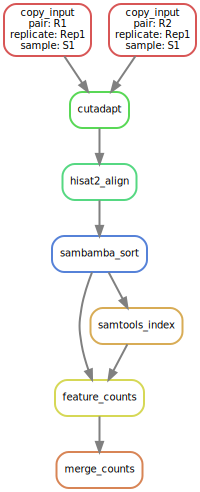

Snakemake-RNAseq
================

|Snakemake| |Wercker|

This is a Snakemake workflow for generating gene expression counts from
RNA-sequencing data using HISAT2, featureCounts (from the subread package), and DESeq2.
The workflow is designed to handle both single-end and paired-end sequencing
data, as well as sequencing data from multiple replicates.

If you use this workflow in a paper, don't forget to give credits
to the authors by citing the URL of this repository and, if available, its
DOI (see above).

This project is forked from a similar project created by Jason de Ruiter but
some of the analysis tools have been swapped out.

.. |Snakemake| image:: https://img.shields.io/badge/snakemake-≥3.13.3-brightgreen.svg
   :target: https://snakemake.bitbucket.io

.. |Wercker| image:: https://app.wercker.com/status/9c3bfb4aa4dbffc027b7a0fcfc00cc57/s/develop
   :target: https://app.wercker.com/project/byKey/9c3bfb4aa4dbffc027b7a0fcfc00cc57

Overview
--------

The pipeline performs the following steps:

* Cutadapt is used to trim the input reads for adapters and/or poor-quality
  base calls
* The trimmed reads are aligned to the reference genome using HISAT2
* The resulting alignments are sorted and indexed using sambamba
* featureCounts is used to generate gene expression counts
* The (per sample) counts are merged into a single count file
* The merged counts are normalized for differences in sequencing depth (using
  DESeq's median-of-ratios approach) and log-transformed

This results in the following dependency graph:

Documentation
-------------

Documentation for this particular pipeline is not yet available but the documentation
for the original pipeline by Jason de Ruiter is still relevant. It can be found at:
http://jrderuiter.github.io/snakemake-rnaseq

License
-------

This software is released under the MIT license.
